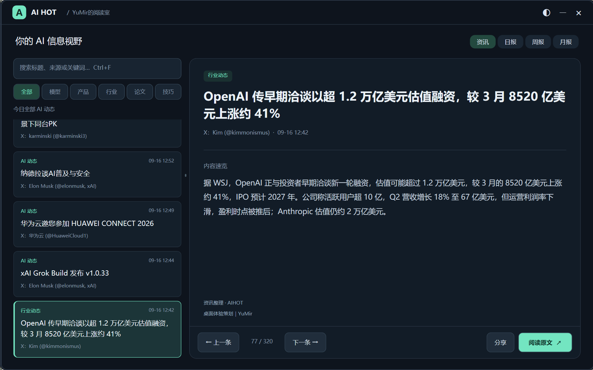
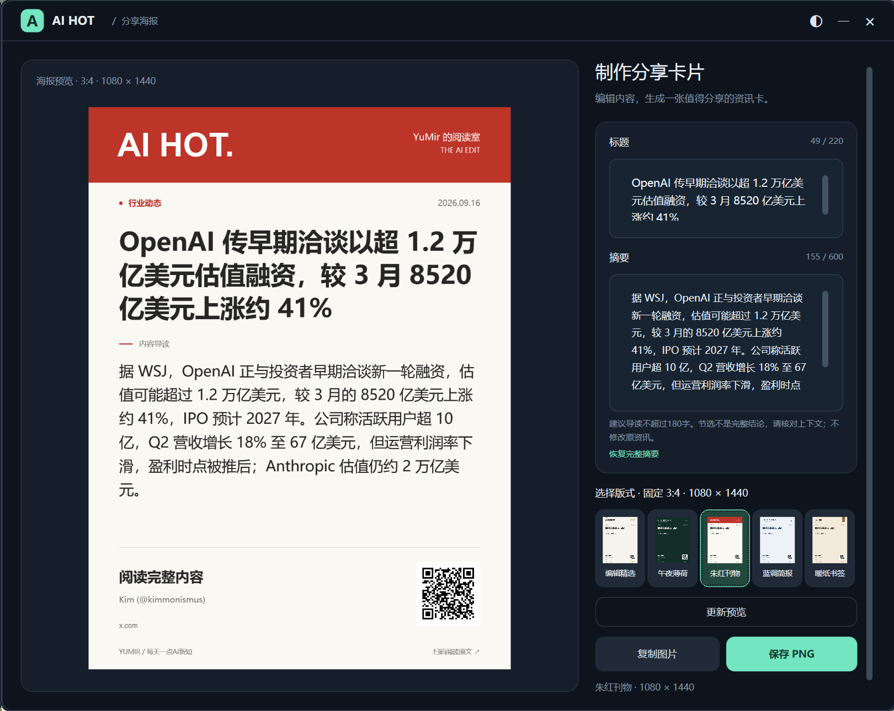

# AIHOT Desktop

**把 AI 新知，放在桌面上。**

一款独立的 Windows AI 资讯阅读工具，提供桌面播报、阅读室、日报 / 周报 / 月报和带原文二维码的分享卡片。基于 .NET 10 与 WPF，自有代码采用 MIT 许可证。

## 界面预览

桌面播报、阅读室与分享卡片，一览日常使用体验。

### 桌面播报

在桌面查看资讯标题和来源，点击跳转原文；支持位置锁定。


### 阅读室

左侧搜索、分类和浏览列表，右侧阅读摘要；可切换资讯、日报、周报和月报。



### 分享卡片

编辑标题与摘要、切换版式，预览后复制图片或保存 PNG，二维码指向原文。



## 主要功能

- **当天动态**：浏览北京时间当天的 AI 资讯，最新内容优先展示。
- **桌面播报**：轮播资讯标题、查看来源，一键打开原文。
- **阅读室**：支持关键词搜索、分类浏览和明暗主题切换。
- **周期报告**：将本机收录的资讯整理成日报、周报和月报，方便回顾。
- **分享卡片**：多种版式、原文二维码、图片复制与 PNG 导出。
- **本地存储**：设置、缓存和历史保存在本机。Telegram 推送为可选功能。

当天资讯来自 AIHOT 数据源，随数据源更新；具体内容以阅读室实际展示为准。

## 获取与运行

### 直接下载使用

查看 [Releases](https://github.com/YuMir1688/AIHOT-Desktop/releases) 的版本说明后下载程序包，解压到独立目录并运行 `AIHOT.Desktop.exe`。

发布包与源码可能存在版本差异，具体功能请查看对应版本说明；体验源码版本可按下方步骤构建。

更新时请先退出程序，并备份原程序目录。

### 从源码构建

需要 Windows 10/11、PowerShell 7 和 .NET 10 SDK。在项目根目录运行：

```powershell
./build.ps1
./test.ps1
./artifacts/app/AIHOT.Desktop.exe
```

产物位于 `artifacts/app/`，运行需要 .NET 10 Desktop Runtime。

构建、测试与当前限制详见 [开发说明](docs/DEVELOPMENT.md)。自动构建状态见 [GitHub Actions](https://github.com/YuMir1688/AIHOT-Desktop/actions)。

## 数据与隐私

本地数据目录：`%LOCALAPPDATA%\YuMir\AIHOT.Desktop`。

- 程序需要联网读取资讯；访问原文会打开外部网站。
- 周期报告只反映本机已保存的内容，长时间未运行时可能存在缺失。
- 不要上传配置、缓存、历史、推送状态或访问凭据。
- Telegram 配置见 [可选推送说明](docs/TELEGRAM.md)，未配置时无需启用。

## 参与与许可

欢迎通过 [Issues](https://github.com/YuMir1688/AIHOT-Desktop/issues) 反馈问题，提交时请说明版本、操作步骤和预期结果，并遮蔽私人信息。

[贡献指南](CONTRIBUTING.md) · [安全说明](SECURITY.md) · [MIT 许可证](LICENSE) · [第三方说明](THIRD_PARTY_NOTICES.md)

MIT 仅覆盖项目自有代码；第三方组件、新闻、摘要、图片及品牌名称仍遵循各自许可与权利范围。

项目创作与维护｜YuMir
